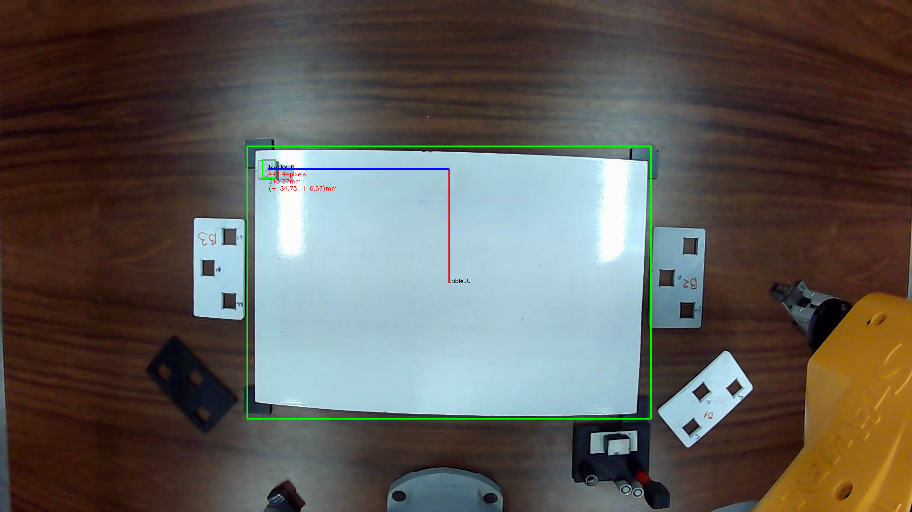
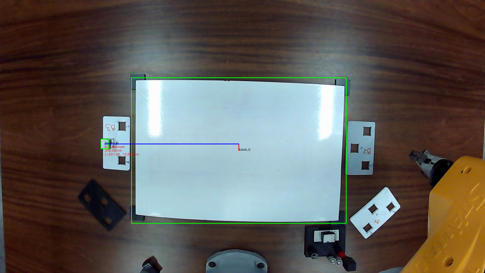
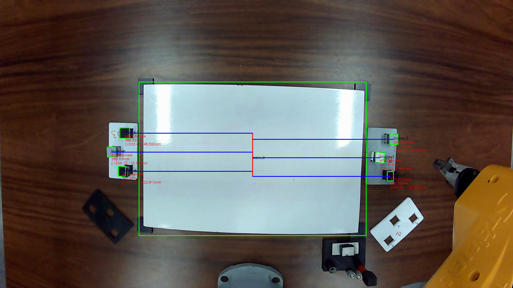
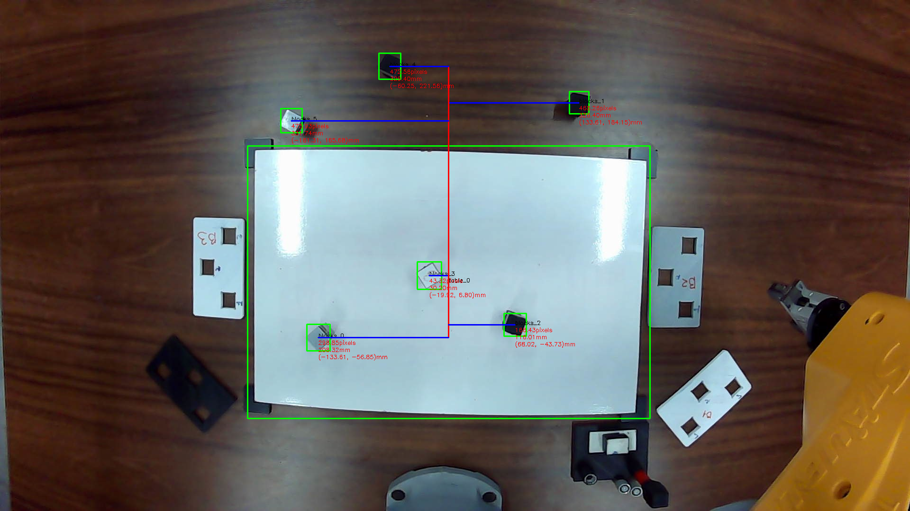

## Frame

#### This is a basic data structure of project

#### Have a utils to instance new frames [full_width, yolov8, random]

#### Have a util to drawer important points of Frames

#### Example image with infer and drawer:

